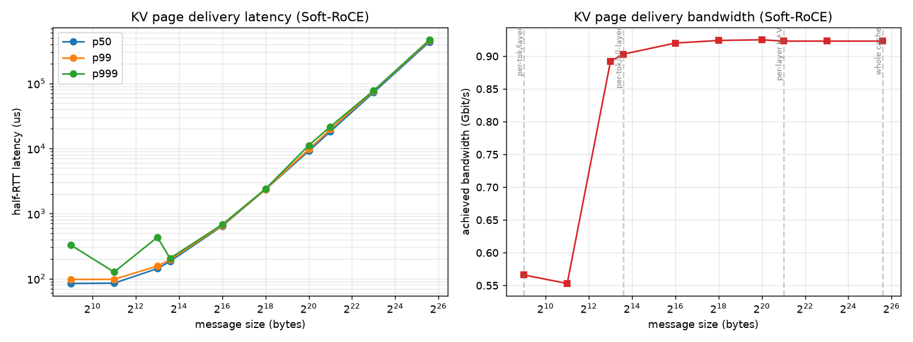
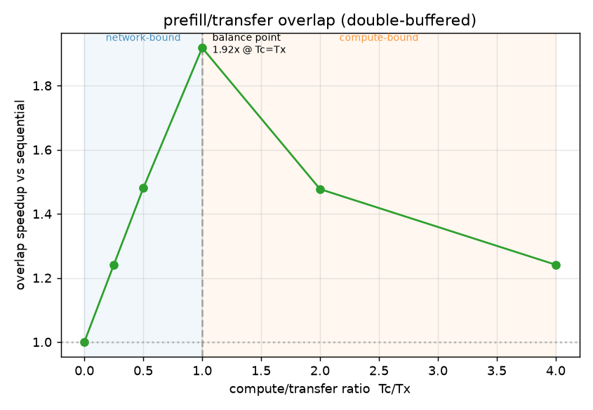

## kvwire

RDMA over RoCE for disaggregated inference. Moves a real Qwen KV Cache (24 layers, 1024 tokens, 48MB) between two machines with verbs in C.

- Soft ROCE on two servers over Ethernet
- TCP bootstrap for out-of-band (qpn, rkey, gid) then state machine (INIT->RTR->RTS)
- One-sided RDMA write
- Sweeps chunk size per-token-per-layer (512B) → per-token (12KB) → per-layer (2MB) → whole cache (48MB)
- measures bandwidth + latency (p50/p99/p999), then double-buffered compute/transfer overlap

Findings: Bandwidth knee at ~12KB. Per-token-per-layer (512B) dominated by overhead.  Move to per-token streaming is at 95% of saturation.   

Overlap peaks at 1.92X of theoretical 2X when Tc = Tx.  

Results are limited to soft RoCE. Real RNIC would change the floors but shape would stay the same.

